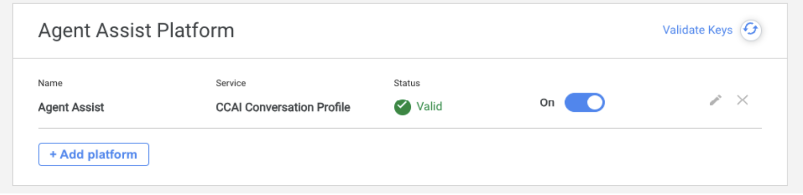
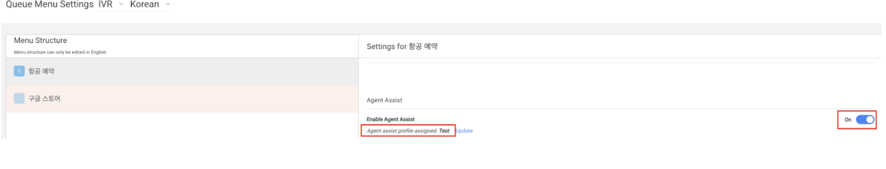

## CCAIP Real-Time Transcript Setup Guide

### Create a Conversation Profile

Real-time transcript is a feature of Agent Assist, so you should create a Conversation Profile in the Agent Assist console. However, the console doesn't support Korean, so you must create one with a REST call or with the client library.

Here is a sample in agent_assist_create_conv_profile.py

After creating the Conversation Profile, you can see it in Agent Assist Console.

https://agentassist.cloud.google.com/projects/[YOUR_PROJECT_ID]/locations/global/conversation-profiles

### Download a service account key
#### Create a service account
Cloud Console > IAM > Service Accounts
Create a service account with the role of **Dialogflow Agent Assist Client** only

#### Download the service account key in json format

### Set up Agent Assist Platform
CCAIP > Settings > Developer Settings > Agent Assist Platform

Upload a json key of the service account
### Call setting
CCAIP > Settings > Call > Agent Assist

Check the Real-Time Call Transcript option

### Queue Setting
CCAIP > Settings > Queue > Agent Assit

Select the conversation profile you created in Agent Assist Console

### Agent Adapter

After call is connected, you can see the Agent Assist button on Agent Adapter and can find Live transcript

